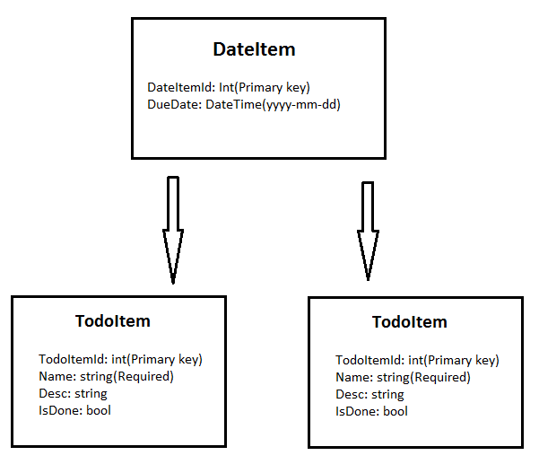

# Appva code test basic CRUD application
A simple CRUD application for a Todo list application

## Notes
### Though process
* A lightweight API with few endpoints that tries to pack as much useful functionallity in as possible, TodoItems can be added to DateItems so that many Todo notes can be grouped under a day

* Using Entity Framework because it has easy integration with Database and lets me not write any SQL code, which is always nice.

* Have tried to implement all API calls as asynchronous tasks to improve client-side experience

### Possible Improvements
* Currently, several DateItems with the same date can be created, in the future this should be changed so that the date is the primary key, leading to no more possible collisions

* Put and Post requests should be sanitized to prevent things like Cross-site scripting etc, Can be a possible security risk

* Fetching of TodoItems related to a given DateItem is not done in the best way here, did not have time to figure it out completely but it works.

## Endpoints
### TodoItem
```
GET api/todo
Returns all TodoItems in list format
```
```
GET api/todo/{id}
Returns specific TodoItem item at given id
```

```
POST api/todo
Takes a TodoItem resource as request body, JSON is accepted
Parameters: {
      int dateItemId(optional) -- Use this if you wish to add the created TodoItem to a DateItem directly
}

Returns 201 success, along with created resource
```
```
DELETE api/todo/{id}
Deletes a TodoItem given an id identifier

Returns 204 No Content on success
```
```
PUT api/todo/{id}
Changes a TodoItem resource given a resource body and a valid id
Remember to provide complete resource body since PATCH is not implemented

Parameters: {
      int dateItemId(optional) -- Use this if you wish to add a TodoItem to a DateItem by using its Id
}

Returns 204 No Content on success
```
### DateItem
```
GET api/todo/day
Returns all DateItems in list format
```
```
GET api/todo/day/{id}
Returns detailed view of DateItem with given id, including all TodoItems related to it
```
```
POST api/todo/day
Takes a DateItem resource as request body, JSON is accepted

return 201 on success, along with created resource
```
```
DELETE api/todo/day/{id}
Deletes a DateItem given an id identifier
NOTE: Deletes related TodoItems using Cascade
```
```
PUT api/todo/day/{id}
Changes a DayItem resource given a resource body and a valid id
Remember to provide complete resource body since PATCH is not implemented
```

## Resources

### TodoItem
```
{
    "TodoItemId": int(Primary key),
    "Name": string(Required),
    "Desc": string,
    "IsDone": bool
}

```
### DateItem
```
{
    "DateItemId": int(Primary key),
    "DueDate": DateTime(yyyy-mm-dd),
}
```
### Resource Structure


## Built using
* ASP.NET core - Using MVC
* Entity Framework - Database management
* MSSQL - Database
